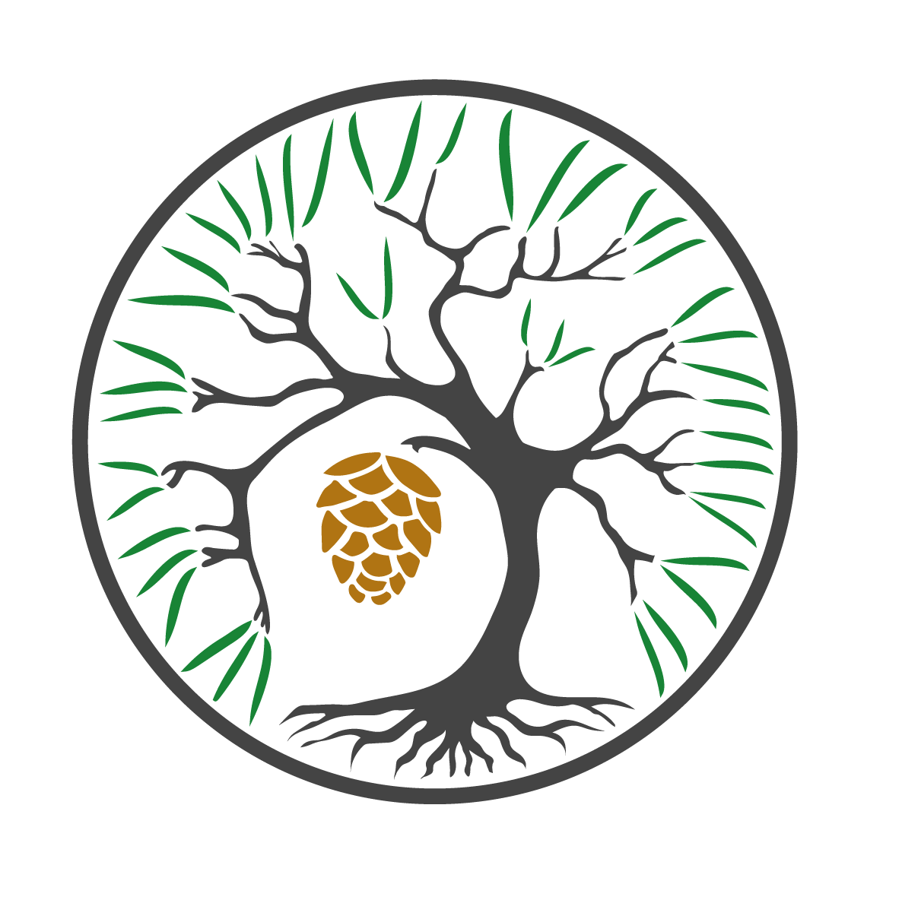
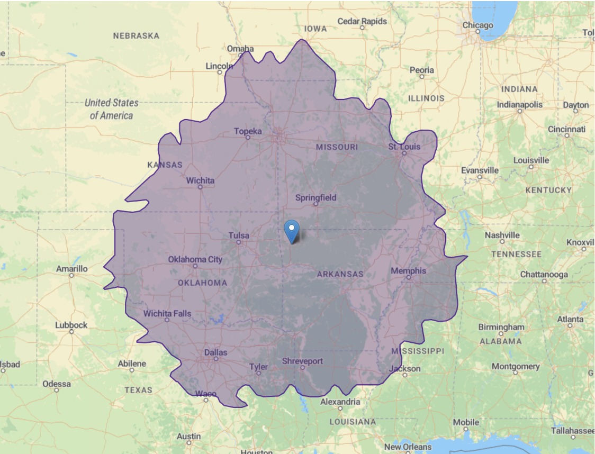

This is a workshop on comparative methods, organized by Jeremy Beaulieu and Brian O'Meara. It is supported by NSF Grants _____. It will be held July 20-24, 2020, in Fayetteville, Arkansas (though we are watching the coronavirus outbreak).

Our goal with the course is to create an inclusive, welcoming place to learn comparative methods. One objective is to provide geographic diversity: there are courses at [Friday Harbor on Evolutionary Quantitative Genetics](https://fhl.uw.edu/courses/course-descriptions/course/evolutionary-quantitative-genetics-workshop-2020/), [Woods Hole Workshop on Molecular Evolution](https://www.mbl.edu/education/courses/workshop-on-molecular-evolution/), and often a workshop at Bodega Bay in California -- all on the coasts and far from our locations in the southeastern United States. Our workshop should be accessible to many people, including those within an 8 hour drive:

## Principles

Some of the principles of our course:

* We will only teach peer-reviewed, published, open source software students can go home and use immediately.
* The main learning objective will be using techniques to understand biology in a question driven way.
* We avoid dogmatic approaches: use Bayes, likelihood, nonparametric approaches: whatever helps you learn about your system — “the best tool for the job.” In many cases, this will not be the software developed by the instructors, but other software in the field.
* We will use best practices in teaching: robust code of conduct, reproducible examples, commitment to diversity.
* All course materials and presentations will be available online.
* The course will be housed in a location in the US Southeast in order to be cheap for travel for students for whom the other courses may be prohibitively expensive. However, at least at the time of planning each year’s course, the course will only be sited in a state that is not subject to a travel ban from other states (i.e., due to California’s ban this excludes Kansas, Mississippi, North Carolina, Tennessee, Alabama, Kentucky, Oklahoma, and Texas but currently still leaves Arkansas, Virginia, Georgia, South Carolina, Florida, Louisiana). If new bans are enacted, the course will be relocated if possible.
* The course will be sustainable year over year -- NSF grants will help support it, but it will be priced so it will run year to year.
* In this first year the per student cost is $___, which includes room and board.

## Topics

* Diversification models
* Continuous trait evolution
* Discrete trait evolution
* Correlated trait evolution

## Software

* R
    * hisse
    * geiger
    * corHMM
    * bayou
    * phylolm
* RevBayes

## Instructors

* Jeremy Beaulieu
* Brian O'Meara

## Location

The workshop is at the ______. It's pretty.

## FAQ

* **What's with the name?**: Loblolly pine trees (*Pinus taeda*) are a common species in the southeastern United States. We figured this would be a memorable name that indicates general region of the conference (which may move around).

## Code of Conduct

This is adopted from [rOpenSci's unconference code of conduct](https://unconf18.ropensci.org/coc.html)

We are committed to providing a welcoming and harassment-free experience for everyone, regardless of gender, gender identity and expression, age, sexual orientation, disability, physical appearance, body size, race, ethnicity, religion (or lack thereof), or technology choices. We do not tolerate harassment of workshop participants in any form. Sexual language and imagery is not appropriate for any workshop venue, including talks, workshops, parties, Twitter and other online media. Workshop participants violating these rules may be sanctioned or expelled from the event at the discretion of the organizers.

This code of conduct applies to all participants, including instructors, and applies to all modes of interaction, both in-person and online.

Workshop participants agree to:

* Be considerate in speech and actions, and actively seek to acknowledge and respect the boundaries of fellow attendees.
* Refrain from demeaning, discriminatory, or harassing behavior and speech. Harassment includes, but is not limited to: deliberate intimidation; stalking; unwanted photography or recording; sustained or willful disruption of talks or other events; inappropriate physical contact; use of sexual or discriminatory imagery, comments, or jokes; and unwelcome sexual attention. If you feel that someone has harassed you or otherwise treated you inappropriately, please alert any member of the conference team in person.
* Take care of each other. Alert a member of the instructor team if you notice a dangerous situation, someone in distress, or violations of this code of conduct, even if they seem inconsequential.

In addition to informal reporting mechanisms above, you can notify Jeremy Beaulieu (jmbeauli@uark.edu) or Brian O'Meara (bomeara@utk.edu) of issues. This is NSF-sponsored; you can report misconduct directly to NSF: see procedures [here](https://www.nsf.gov/od/odi/harassment.jsp) or reach out directly to their Office of Diversity and Inclusion at [programcomplaints@nsf.gov](mailto:programcomplaints@nsf.gov) or (703) 292-8020. You can also reach out to your own institution's or the instructors' institutions' Office of Title IX, Office of Equity & Diversity, or similar.

We don't anticipate any issues, and instructors have been carefully selected for the workshop. However, harassment and other inappropriate conduct is common in biology ([Clancy et al. 2014](https://doi.org/10.1371/journal.pone.0102172), [Nelson et al. 2017](https://doi.org/10.1111/aman.12929), [NASEM 2018](https://www.nap.edu/catalog/24994/sexual-harassment-of-women-climate-culture-and-consequences-in-academic), [O'Meara et al. 2019](https://figshare.com/articles/Unwelcome_behaviors_at_the_Evolution_meetings_Survey_results/8311595)),  and we take it seriously.

## Sign up

<iframe src="https://docs.google.com/forms/d/e/1FAIpQLSe8-cGhkxOeSs0TSBCFwu6aKoKlsA4M_mAhbaRwe5-Fgi5eCA/viewform?embedded=true" width="640" height="2287" frameborder="0" marginheight="0" marginwidth="0">Loading…</iframe>
